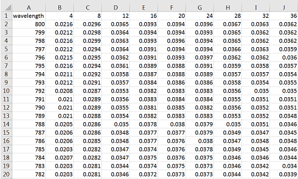
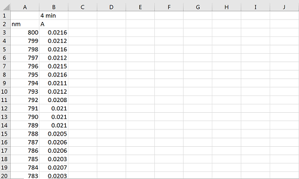
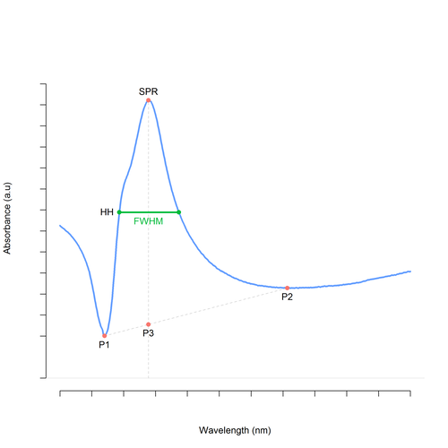

# 1 Overview

*NanoUV-VIS* is an interactive web application designed for the analysis of multiple UV-VIS spectrum measurements as a function of time, creating different graphical visualizations in 2 and 3 dimensions such a spectrum plots, surface plot, and contour plot. This tool evaluate important parameters of the absorption bands of the NPs. Specifically, it provides their maximum optical absorbance, Surface Plasmon Resonance peak (SPR) and Full Width at Half maximum (FWHM).These parameters are closely related to the diameter, shape, and polydispersity of metal and semiconductor NPs. Therefore, this application can be used to monitor the nano-manufacturing of NPs, to understand its stability under different conditions and mediums, to establish their optical properties, among others studies which use spectrochemical analysis (UV-VIS) as technique to characterize NPs. 

# 2 Quick Instructions

## 2.1 Data Upload

To begin the exploration of your data, select **<i class="fa fa-file-text"></i> Data** panel. Then, you will find two options to upload your experimental data in the **csv** format:

* Choose **Single file** if you have a pre-formatted data-set as showed on Figure 1 below. It's required a csv file where the first collumn represents the wavelength (ordered or not) and the rest are the absorbances by time - not necesarily ordered. Press "Browse" to find your data in your computer and "Load table" to start the visualizations;

Figure 1. Illustration of pre-formated single file csv data set.

* or choose **Multiple Files** if you have many csv files, each one representing a spectrum to be merged. It has been designed for instruments that generates or exports data as independent file, as showed on Figure 2. Press "Browse" to find your data in your computer and "Create table" to start the visualizations. In this case a new button will appear, possibiliting to save the joint table, created by merging each csv file.

Figure 2. Illustration of an independent file exported by the instrument.

Observe that in both cases it is possible to change the names and the unities of each dimention being considered in the calculations. 

Finally, the experimental data can be seen in a nice interactive table, where one can do searchs, sort data by columns, etc. 

## 2.2 Visualization

To start with the visualization and graphical analysis, select the **<i class="fa fa-bar-chart"></i> Visualization** panel and choose the type of graphic you want to explore. There are three different forms of _visualize_ the uploaded data:

* In **Surface** tab you can see a 3D surface plot of your data with a free degree of motion. 
* In **Contour** tab you can see a 2D contour plot of your data.
* In **Spectrum** to plot the individual spectra. This graphics also displays graphically the SPR and FWHM values.

Two other plots are displayed by using the different variables estimated in the analysis: (i) maximum optical absorbance; (ii) surface plasmon resonance peak (SPR); and (iii) Full Width at Half Maximum (FWHM). The plots are:

* In **MixSpectrum** tab you can (dynamically) display a number of different NPs spectra on the same plot. All mentioned parameters can be compared by dragging your mouse over the plot; 
* In **Optical** tab you can see the scatter plots of the three quantities above mentioned as function of the time, making easier the comparision between them.

## 2.3 Results

Select the **<i class="fa fa-table"></i> Results** panel to see a table with numerical results provided by *NanoUV-VIS*. You will find the parameters evaluated for each UV-VIS spectrum, as shown is Figure 2 below:

 

Figure 3. Graphical  representation of used points of spectrum data.
 

In the results you can choose the number of columns to display, sort the data, and search a specific variable.

To download the results provided by the *NanoUV-VIS*, click **<i class="fa fa-download"></i> Download Results**.

# 3 Licence

This software was developed by Gabriel F. Sarmanho and Bryan Calderon Jimenez and is available freely under the [NIST](https://www.nist.gov/) license. The source code is [available](https://github.com/gfsarmanho/NanoUV-VIS) on GitHub.

For any comments or questions, please send e-mail to: gabriel.sarmanho@nist.gov.

