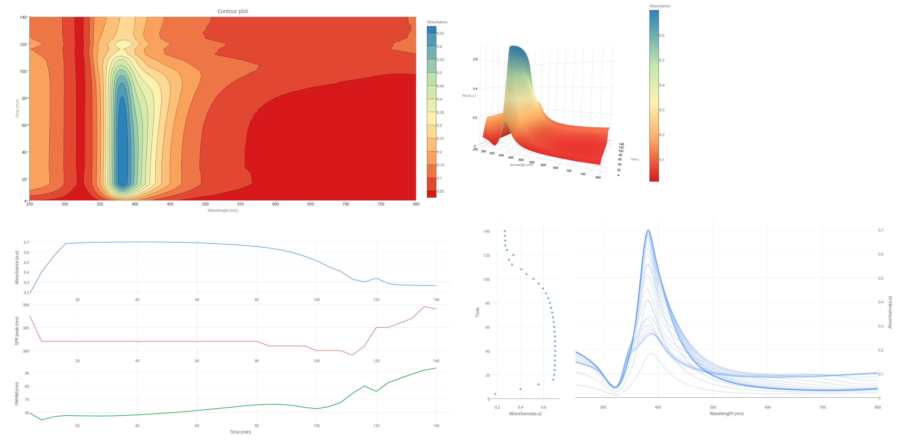
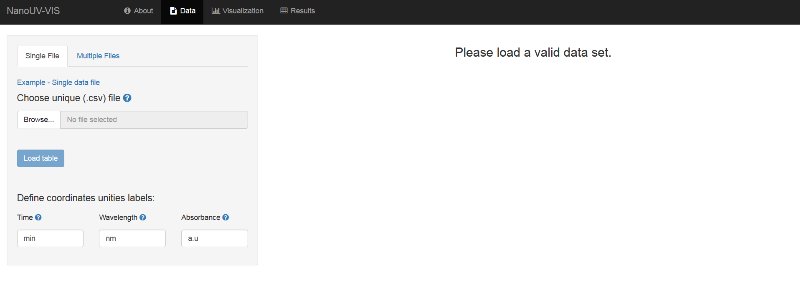
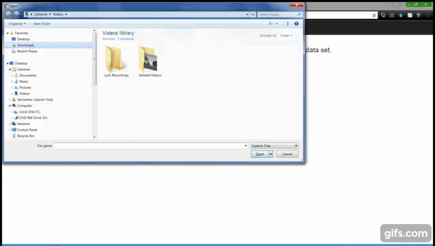

# NanoUV-VIS

> An interactive visualization tool for monitoring the evolution of optical properties of nanoparticles throughout synthesis reactions.

<p align="center">

</p>

# Installation

To use *NanoUV-VIS* in your PC, you will need first to install [R](https://cloud.r-project.org/) statistical software. We recommend to use [RStudio](https://www.rstudio.com/products/rstudio/download/) editor, in order to have a better experience with this [Shiny](https://shiny.rstudio.com/) application.

Second, you will need to install the following R packages: `shiny`, `shinyjs`, `knitr`, `rmarkdown`, `shinycssloaders`, `plotly`, `plot3D`, `DT`, `crosstalk` and `htmlwidgets`. To install them from CRAN, use the following R code:

```r
install.packages(c("shiny", "shinyjs", "knitr", "rmarkdown", "shinycssloaders", "plotly", "plot3D", "DT", "crosstalk", "htmlwidgets"))
```

After the local installation, you will be ready to run the application! Just type on R/RStudio console:

```r
shiny::runGitHub("gfsarmanho/NanoUV-VIS")
```
If there are no error messages, you are ready to enjoy *NanoUV-VIS*! 

> **NOTE:** Remember not to close R/RStudio after initiate the web application!

# Getting Started

After start the application, you should see the following screen on your web browser:

<p align="center">

</p>

Click in **About** tab to see an overview of the application, describing the way you should upload your UV-VIS data and the available interactive plots. For more detailed information and description of the tool using a real experiment, please check [Calderon-Jimenez et. al, 2017](https://www.google.com).

In the following gif you will find some quick instructions to run *NanoUV-VIS* using an example data set.



# Contributions
Any suggestions or contributions to this project (comments, questions, typo corrections, etc.) are more than welcome! You can do it directly on this GitHub repository or mail to <gabriel.sarmanho@nist.gov> and <bryan.calderonjimenez@nist.gov>.

# License and Disclaimer Statement
This software was developed under [NIST](https://www.nist.gov/) license. Click [here](LICENSE.md) to read it and [here](DISCLAIMER.md) to access ths disclaimer statement.
